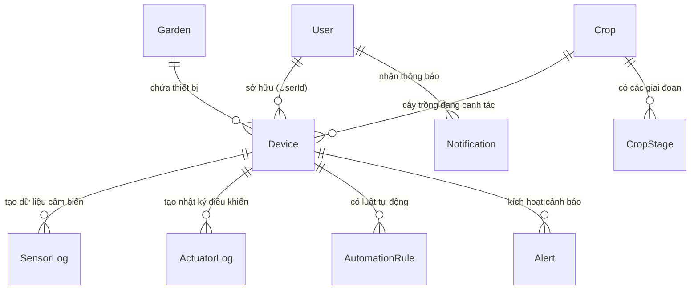
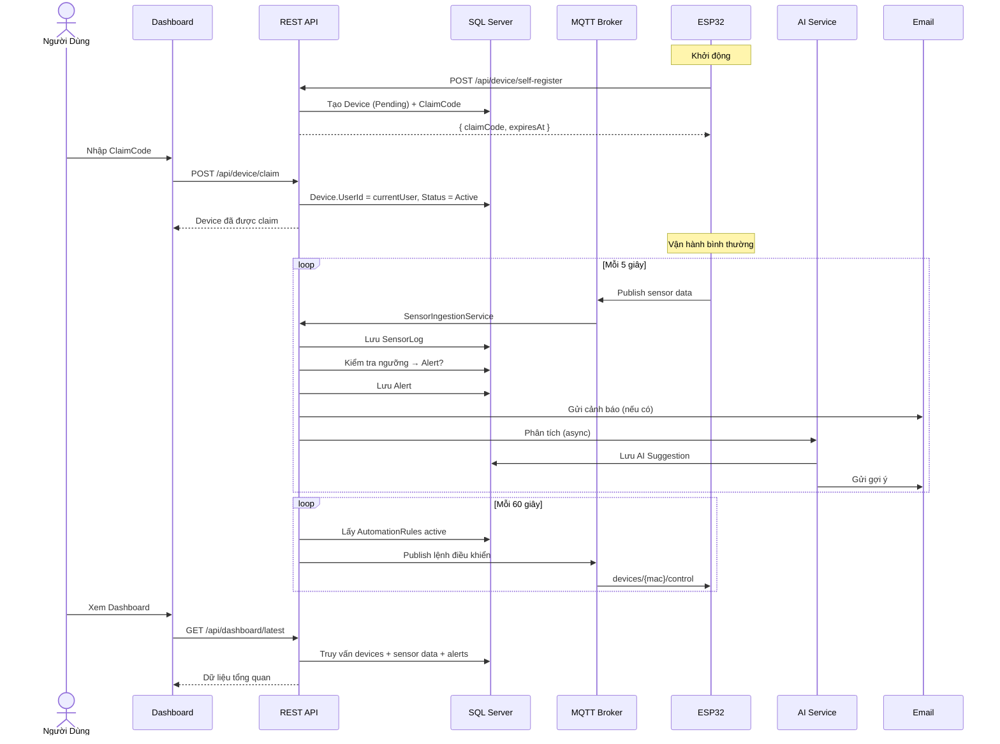

# AeroponicIOT — Nghiệp Vụ & Luồng Chạy Hệ Thống

> Tài liệu mô tả tổng quan nghiệp vụ và luồng vận hành của hệ thống AeroponicIOT — nền tảng nông nghiệp thông minh (smart farming) cho mô hình khí canh (aeroponics).

---

## Mục Lục

1. [Tổng Quan Hệ Thống](#1-tổng-quan-hệ-thống)
2. [Mô Hình Dữ Liệu & Quan Hệ](#2-mô-hình-dữ-liệu--quan-hệ)
3. [Vòng Đời Thiết Bị (Device Lifecycle)](#3-vòng-đời-thiết-bị-device-lifecycle)
4. [Luồng Dữ Liệu Cảm Biến (Sensor Data Flow)](#4-luồng-dữ-liệu-cảm-biến-sensor-data-flow)
5. [Luồng Tự Động Hóa (Automation Flow)](#5-luồng-tự-động-hóa-automation-flow)
6. [Luồng AI Gợi Ý Canh Tác (AI Suggestion Flow)](#6-luồng-ai-gợi-ý-canh-tác-ai-suggestion-flow)
7. [Luồng Thông Báo (Notification Flow)](#7-luồng-thông-báo-notification-flow)
8. [Pipeline Middleware & Xử Lý Request](#8-pipeline-middleware--xử-lý-request)
9. [Hệ Thống Dịch Vụ Nền (Background Services)](#9-hệ-thống-dịch-vụ-nền-background-services)
10. [Bảo Mật & Phân Quyền](#10-bảo-mật--phân-quyền)
11. [Giám Sát & Bảo Trì](#11-giám-sát--bảo-trì)
12. [Sơ Đồ Tổng Thể](#12-sơ-đồ-tổng-thể)

---

## 1. Tổng Quan Hệ Thống

**AeroponicIOT** là một nền tảng IoT toàn diện dành cho nông nghiệp khí canh, được xây dựng trên **ASP.NET Core 8.0**. Hệ thống kết nối các thiết bị ESP32/Zigbee với máy chủ trung tâm thông qua **HTTP API** và **MQTT Broker nhúng**, cho phép:

- 📡 **Thu thập dữ liệu cảm biến** thời gian thực (pH, TDS, nhiệt độ nước, độ ẩm không khí, cường độ ánh sáng)
- 🤖 **Tự động hóa** điều khiển thiết bị (bơm, quạt, đèn, máy sưởi) theo lịch, ngưỡng hoặc hẹn giờ
- 🧠 **AI phân tích** dữ liệu cảm biến và đưa ra gợi ý canh tác thông minh
- 🔔 **Cảnh báo & thông báo** đa kênh (in-app + email) khi chỉ số vượt ngưỡng
- 📊 **Dashboard** tổng quan tình trạng toàn bộ vườn và thiết bị
- 🌱 **Quản lý cây trồng** với các giai đoạn sinh trưởng và thông số tối ưu cho từng giai đoạn

### Kiến Trúc Giao Tiếp

```
ESP32 / Zigbee ──HTTP──▶ REST API (port 5062)
       │                       │
       └──MQTT──▶ MQTT Broker (port 1883) ──▶ SensorIngestionService
                                               │
                                               ▼
                                        SQL Server Database
```

---

## 2. Mô Hình Dữ Liệu & Quan Hệ

### 2.1 Sơ Đồ Quan Hệ (ERD)



### 2.2 Mô Tả Các Entity Chính

| Entity | Bảng | Mô Tả |
|--------|------|-------|
| **User** | `users` | Người dùng hệ thống (Farmer / Administrator). Xác thực qua JWT. |
| **Device** | `devices` | Thiết bị IoT (ESP32/Zigbee). Có MAC address duy nhất, trạng thái, firmware version. |
| **SensorLog** | `sensor_logs` | Bản ghi dữ liệu cảm biến theo thời gian: pH, TDS, nhiệt độ nước, độ ẩm, ánh sáng. |
| **ActuatorLog** | `actuator_logs` | Nhật ký lệnh điều khiển thiết bị (bật/tắt bơm, quạt, đèn, máy sưởi). |
| **Crop** | `crops` | Loại cây trồng (VD: Xà lách, Húng quế, Dâu tây). |
| **CropStage** | `crop_stages` | Giai đoạn sinh trưởng với khoảng thông số tối ưu (pH, TDS, nhiệt độ, độ ẩm, chu kỳ bơm). |
| **AutomationRule** | `automation_rules` | Luật tự động hóa: loại (lịch/ngưỡng/hẹn giờ), điều kiện, hành động, ưu tiên. |
| **Garden** | `gardens` | Vườn / khu vực canh tác (chứa nhiều thiết bị). |
| **Alert** | `alerts` | Cảnh báo khi chỉ số vượt ngưỡng, phân loại theo mức độ nghiêm trọng. |
| **Notification** | `notifications` | Thông báo gửi đến người dùng (in-app + email). |

### 2.3 Trạng Thái Thiết Bị

| Trạng Thái | Ý Nghĩa |
|------------|---------|
| `Pending` | Mới tự đăng ký, chưa được người dùng claim |
| `Active` | Đã được claim, đang hoạt động bình thường |
| `Online` | Đang kết nối và gửi dữ liệu |
| `Offline` | Mất kết nối |
| `Inactive` | Ngừng hoạt động |

---

## 3. Vòng Đời Thiết Bị (Device Lifecycle)

### 3.1 Luồng Tự Đăng Ký (Self-Registration)

```
┌──────────────────────────────────────────────────────────────────────┐
│                        DEVICE SELF-REGISTRATION                       │
└──────────────────────────────────────────────────────────────────────┘

   ESP32                          REST API                        Database
   ─────                          ────────                        ────────
     │                                │                               │
     │  POST /api/device/self-register│                               │
     │  Header: X-Device-Key          │                               │
     │  Body: { macAddress,           │                               │
     │          deviceName,           │                               │
     │          chipId,               │                               │
     │          firmwareVersion }     │                               │
     │───────────────────────────────▶│                               │
     │                                │                               │
     │                    ┌───────────┴───────────┐                   │
     │                    │ Validate SharedKey    │                   │
     │                    │ Rate-limit check      │                   │
     │                    │ (per IP)              │                   │
     │                    └───────────┬───────────┘                   │
     │                                │                               │
     │                                │  Upsert Device                │
     │                                │  (MAC = key)                  │
     │                                │──────────────────────────────▶│
     │                                │                               │
     │                                │  Generate 6-char claim code   │
     │                                │  Set expiry = now + 10 min    │
     │                                │◀──────────────────────────────│
     │                                │                               │
     │  Response: { success,          │                               │
     │    deviceId, claimCode,        │                               │
     │    claimCodeExpiresAt }        │                               │
     │◀───────────────────────────────│                               │
     │                                │                               │
     │  ┌─────────────────────────┐   │                               │
     │  │ Show claim code on LCD  │   │                               │
     │  │ Retry every 30s until   │   │                               │
     │  │ device is claimed       │   │                               │
     │  └─────────────────────────┘   │                               │
```

### 3.2 Luồng Claim Thiết Bị

```
   User (Dashboard)                REST API                        Database
   ────────────────                ────────                        ────────
     │                                │                               │
     │  POST /api/device/claim        │                               │
     │  Body: { claimCode,            │                               │
     │          name, cropId,         │                               │
     │          gardenId }            │                               │
     │───────────────────────────────▶│                               │
     │                                │                               │
     │                    ┌───────────┴───────────┐                   │
     │                    │ Find device by        │                   │
     │                    │ claimCode + not expired│                  │
     │                    │ Rate-limit check      │                   │
     │                    └───────────┬───────────┘                   │
     │                                │                               │
     │                                │  Device.UserId = currentUser │
     │                                │  Device.Status = "Active"    │
     │                                │  Device.DeviceName = name    │
     │                                │  Device.CurrentCropId = crop │
     │                                │  Device.GardenId = garden    │
     │                                │  Clear claim code            │
     │                                │──────────────────────────────▶│
     │                                │                               │
     │  Response: { success, device } │                               │
     │◀───────────────────────────────│                               │
```

---

## 4. Luồng Dữ Liệu Cảm Biến (Sensor Data Flow)

Đây là **luồng nghiệp vụ cốt lõi** của hệ thống. Dữ liệu cảm biến có thể đến từ 3 nguồn:

### 4.1 Ba Đường Dẫn Dữ Liệu

```
Đường 1: HTTP POST /api/sensor
   ESP32 ──HTTP POST──▶ SensorController ──▶ ISensorIngestionService

Đường 2: MQTT WiFi
   ESP32 ──MQTT Publish──▶ devices/{mac}/sensor
        ──▶ MqttService.InterceptingPublishAsync ──▶ ISensorIngestionService

Đường 3: Zigbee2MQTT Bridge
   Zigbee Device ──▶ zigbee2mqtt/... ──▶ MqttService ──▶ ZigbeePayloadMapper
        ──▶ Map to SensorDataDto ──▶ ISensorIngestionService
```

### 4.2 Chi Tiết Luồng Xử Lý SensorIngestionService

```
SensorIngestionService.ProcessSensorDataAsync(sensorData)
│
├── 1. Chuẩn hóa MAC address (uppercase, trim)
│
├── 2. Làm sạch dữ liệu (sanitize)
│   ├── pH:       giới hạn [0, 14]
│   ├── TDS:      giới hạn [0, 50000]
│   ├── Nhiệt độ: giới hạn [-20, 100]°C
│   ├── Độ ẩm:   giới hạn [0, 100]%
│   └── Ánh sáng: giới hạn [0, 200000] lux
│
├── 3. Tìm Device theo MAC → nếu không tìm thấy → 404
│
├── 4. Cập nhật Device.LastSeen = now
│
├── 5. Tạo SensorLog (lưu cả giá trị raw + rounded)
│
├── 6. Kiểm tra ngưỡng cây trồng (nếu có Crop được gán)
│   ├── Lấy CropStage hiện tại dựa trên ngày canh tác
│   ├── So sánh pH, TDS, nhiệt độ nước, độ ẩm với [min, max]
│   └── Nếu vượt ngưỡng → tạo Alert (Severity: High/Critical/Warning)
│
├── 7. Lưu SensorLog + Alert vào DB
│
├── 8. Gửi thông báo cảnh báo (nếu có Alert)
│   └── INotificationService.SendAlertNotificationAsync
│
└── 9. Kích hoạt AI phân tích (fire-and-forget, không chặn)
    └── Task.Run → IAISuggestionService.AnalyzeSensorDataAsync
```

---

## 5. Luồng Tự Động Hóa (Automation Flow)

### 5.1 Các Loại Luật Tự Động

| Loại | Mã | Mô Tả | Ví Dụ |
|------|-----|-------|-------|
| **Schedule** | 0 | Kích hoạt theo lịch (giờ + ngày trong tuần) | Bật đèn lúc 6:00 mỗi ngày |
| **Threshold** | 1 | Kích hoạt khi chỉ số vượt ngưỡng | Bật quạt khi nhiệt độ > 28°C |
| **Timer** | 2 | Kích hoạt định kỳ theo chu kỳ | Bật bơm mỗi 30 phút trong 5 phút |

### 5.2 Luồng Thực Thi

```
AutomationBackgroundService (chạy mỗi 60 giây)
│
├── 1. Truy vấn tất cả AutomationRule có IsActive = true
│      JOIN với Device, sắp xếp theo Priority giảm dần
│
├── 2. Với mỗi rule, kiểm tra loại:
│
│   ┌── Schedule ─────────────────────────────────────┐
│   │  Kiểm tra:                                       │
│   │  - Thời gian hiện tại == ScheduleTime?           │
│   │  - Ngày hiện tại nằm trong ScheduleDays?         │
│   │  - Chưa thực thi trong vòng 1 phút?              │
│   │  → Nếu đúng: kích hoạt                           │
│   └──────────────────────────────────────────────────┘
│
│   ┌── Threshold ────────────────────────────────────┐
│   │  Lấy SensorLog mới nhất của thiết bị             │
│   │  So sánh: ConditionParameter vs ConditionValue   │
│   │  (Toán tử: >, <, ==, >=, <=)                    │
│   │  - Chưa thực thi trong vòng 5 phút?              │
│   │  → Nếu đúng: kích hoạt                           │
│   └──────────────────────────────────────────────────┘
│
│   ┌── Timer ────────────────────────────────────────┐
│   │  Kiểm tra:                                       │
│   │  - Đã qua DurationMinutes kể từ LastExecuted?    │
│   │  → Nếu đúng: kích hoạt                           │
│   └──────────────────────────────────────────────────┘
│
└── 3. Khi kích hoạt:
    ├── Tạo MQTT message: { action, actuatorType }
    ├── Publish tới: devices/{mac}/control
    ├── Lưu ActuatorLog
    └── Cập nhật LastExecuted
```

### 5.3 Các Loại Thiết Bị Điều Khiển (Actuator)

| Mã | Loại | Mô Tả |
|----|------|-------|
| 0 | Pump | Máy bơm dung dịch dinh dưỡng |
| 1 | Fan | Quạt thông gió |
| 2 | Light | Đèn LED chiếu sáng |
| 3 | Heater | Máy sưởi / gia nhiệt |

---

## 6. Luồng AI Gợi Ý Canh Tác (AI Suggestion Flow)

```
Kích hoạt bởi:
  1. Sau mỗi lần SensorIngestionService xử lý (fire-and-forget)
  2. AIAnalysisBackgroundService chạy mỗi 15 phút

┌─────────────────────────────────────────────────────────────────┐
│                IAISuggestionService.AnalyzeSensorDataAsync       │
└─────────────────────────────────────────────────────────────────┘
│
├── 1. Kiểm tra điều kiện tiên quyết
│   ├── AI có được bật? (AISuggestions:Enabled)
│   ├── API Key đã được cấu hình?
│   └── Chưa hết thời gian cooldown? (mặc định 60 phút)
│
├── 2. Thu thập ngữ cảnh
│   ├── Thông tin Device (tên, trạng thái)
│   ├── Thông tin Crop + CropStage hiện tại
│   ├── Khoảng tối ưu từ CropStage (pH, TDS, nhiệt độ...)
│   ├── SensorLog mới nhất
│   └── 6 SensorLog gần nhất để phân tích xu hướng
│
├── 3. Tạo Prompt cho AI (OpenAI-compatible API)
│   ├── System role: "Bạn là chuyên gia nông nghiệp khí canh..."
│   ├── User context: thông tin thiết bị + giai đoạn + chỉ số + xu hướng
│   └── Yêu cầu trả về JSON: { title, message, type, suggested_action, confidence }
│
├── 4. Gọi AI API (OpenAI Chat Completions format)
│   └── Model mặc định: gpt-4o-mini
│
├── 5. Parse kết quả JSON → AiSuggestionResult
│
├── 6. Gửi gợi ý dưới dạng Notification đến chủ thiết bị
│
└── 7. Đặt cooldown cho thiết bị (key: ai_suggestion_cooldown:{deviceId})
```

---

## 7. Luồng Thông Báo (Notification Flow)

```
Các sự kiện kích hoạt thông báo:
  - Cảm biến vượt ngưỡng → AlertNotification
  - AI đưa ra gợi ý → Info/Warning Notification
  - Hệ thống có sự kiện quan trọng

┌──────────────────────────────────────────────────────────────┐
│                    NotificationService                        │
└──────────────────────────────────────────────────────────────┘
│
├── SendNotificationAsync(title, message, type, userId)
│   ├── 1. Tạo Notification record trong DB
│   │      - Title, Message, Type (Info/Warning/Alert/Critical)
│   │      - IsRead = false
│   │      - UserId (nullable)
│   │
│   └── 2. Gửi email (nếu user có email và EmailSettings được bật)
│       └── EmailService.SendEmailAsync
│           ├── SMTP qua MailKit
│           ├── Hỗ trợ STARTTLS (port 587) & SSL (port 465)
│           └── Email HTML: header màu theo loại + link Dashboard
│
├── SendAlertNotificationAsync(alert, device)
│   └── Mapping Severity → NotificationType:
│       ├── High/Critical → Alert
│       └── Medium/Warning → Warning
│
├── GetUnreadNotificationsAsync(userId)
│   └── Trả về thông báo chưa đọc, sắp xếp mới nhất trước
│
├── MarkAsReadAsync(notificationId, userId)
│   └── Kiểm tra quyền sở hữu → đánh dấu đã đọc
│
└── ClearNotificationsAsync(userId)
    └── Xóa tất cả thông báo của user (ExecuteDeleteAsync)
```

---

## 8. Pipeline Middleware & Xử Lý Request

### 8.1 Thứ Tự Pipeline (Quan Trọng — Thứ Tự Ảnh Hưởng Đến Hành Vi)

```
Request
  │
  ├── 1. app.UseSwagger() + app.UseSwaggerUI()       [DEV only]
  │
  ├── 2. app.UseForwardedHeaders()                    [X-Forwarded-For/Proto]
  │
  ├── 3. CorrelationIdMiddleware                      [Thêm X-Correlation-ID]
  │
  ├── 4. RequestLoggingMiddleware                     [Log HTTP request/response]
  │     └── Bỏ qua: /health, /favicon.ico, static files
  │
  ├── 5. PerformanceBudgetMiddleware                  [Đo latency]
  │     ├── GET /api/dashboard/latest: budget 300ms
  │     └── POST /api/sensor:          budget 150ms
  │
  ├── 6. GlobalExceptionHandlingMiddleware            [Bắt lỗi → ProblemDetails]
  │     ├── DomainValidationException → 400 Bad Request
  │     ├── ResourceNotFoundException  → 404 Not Found
  │     ├── UnauthorizedAccessException → 401 Unauthorized
  │     └── DbUpdateException          → 409 Conflict
  │
  ├── 7. app.UseHttpsRedirection()                    [Bỏ qua trong môi trường Testing]
  │
  ├── 8. app.UseCors("ConfiguredOrigins")             [CORS policy]
  │
  ├── 9. app.UseRateLimiter()                         [Rate limiting]
  │     ├── "auth": giới hạn đăng nhập/đăng ký
  │     └── "device-onboarding": giới hạn self-register/claim theo IP
  │
  ├── 10. app.UseAuthentication()                     [JWT Bearer validation]
  │
  ├── 11. app.UseAuthorization()                      [Role-based policies]
  │      ├── "AdminOnly": chỉ Administrator
  │      └── "FarmerOrAdmin": Farmer hoặc Admin
  │
  ├── 12. app.UseStaticFiles()                        [wwwroot/]
  │
  ├── 13. Health Checks: /health/live, /health/ready
  │
  ├── 14. app.MapGet("/") → index.html                [Dashboard mặc định]
  │
  └── 15. app.MapControllers()                        [API Endpoints]
```

### 8.2 Chuẩn Hóa Response

Tất cả API endpoint đều trả về response theo định dạng thống nhất:

```json
{
  "success": true,
  "message": "Operation completed successfully",
  "data": { ... },
  "timestamp": "2026-06-28T10:30:00Z"
}
```

Lỗi được chuẩn hóa theo **RFC 7807 ProblemDetails**:

```json
{
  "type": "https://tools.ietf.org/html/rfc7231#section-6.5.1",
  "title": "Bad Request",
  "status": 400,
  "detail": "Validation error message",
  "correlationId": "abc-123-def",
  "errorCode": "VALIDATION_ERROR"
}
```

---

## 9. Hệ Thống Dịch Vụ Nền (Background Services)

| Dịch Vụ | Chu Kỳ | Chức Năng |
|---------|--------|-----------|
| **MqttService** | Singleton, khởi động cùng app | Embedded MQTT broker, xác thực client, ACL phân quyền topic, bridge Zigbee2MQTT |
| **AutomationBackgroundService** | Mỗi 60 giây | Đánh giá và thực thi tất cả luật tự động hóa đang hoạt động |
| **AIAnalysisBackgroundService** | Mỗi 15 phút | Duyệt tất cả thiết bị đang hoạt động, gọi AI phân tích cho từng thiết bị |
| **LogRetentionBackgroundService** | Mỗi 24 giờ | Dọn dẹp SensorLog > 90 ngày và ActuatorLog > 180 ngày |

---

## 10. Bảo Mật & Phân Quyền

### 10.1 Xác Thực

```
┌─────────────────────────────────────────────────────────────────┐
│                    JWT Authentication Flow                       │
└─────────────────────────────────────────────────────────────────┘

  Client                          Server
  ──────                          ──────
    │                                │
    │  POST /api/authentication/login│
    │  { username, password }        │
    │───────────────────────────────▶│
    │                                │
    │                    ┌───────────┴───────────┐
    │                    │ Verify password hash  │
    │                    │ (BCrypt)              │
    │                    │ Generate JWT:         │
    │                    │  - HMAC-SHA256        │
    │                    │  - Expiry: 1440 min   │
    │                    │  - Claims: userId,    │
    │                    │    username, role     │
    │                    └───────────┬───────────┘
    │                                │
    │  { token, username, role,      │
    │    userId, expiresAt }         │
    │◀───────────────────────────────│
    │                                │
    │  Các request sau:              │
    │  Header: Authorization:        │
    │  Bearer {token}                │
    │───────────────────────────────▶│
    │                                │
    │                    ┌───────────┴───────────┐
    │                    │ Validate signature    │
    │                    │ Validate expiry       │
    │                    │ Extract claims        │
    │                    │ Check role policy     │
    │                    └───────────────────────┘
```

### 10.2 Phân Quyền (Authorization Policies)

| Policy | Vai Trò | Áp Dụng Cho |
|--------|---------|-------------|
| `AdminOnly` | Administrator | Quản lý người dùng, cấu hình MQTT, publish MQTT, quản lý garden |
| `FarmerOrAdmin` | Farmer + Admin | Dashboard, thiết bị, cảm biến, automation, crop |

### 10.3 Bảo Vệ Chống Tấn Công

- **Rate Limiting**: Giới hạn đăng nhập/đăng ký (`auth`) và tự đăng ký thiết bị (`device-onboarding`) theo IP
- **Onboarding Protection**: Sau 5 lần thất bại trong 300 giây → chặn IP trong 120 giây
- **JWT Expiry**: Token hết hạn sau 1440 phút (24 giờ), ClockSkew = 0
- **Mật khẩu**: Yêu cầu tối thiểu 8 ký tự, có chữ hoa + chữ thường + số
- **Mã Claim**: 6 ký tự base32, hết hạn sau 10 phút, tự động xóa sau khi claim thành công

### 10.4 Bảo Mật MQTT

- **Xác thực client**: Username/Password hoặc MAC-derived HMAC với shared key
- **Topic ACL**: Client chỉ được publish vào `devices/{mac}/sensor` tương ứng với MAC đã xác thực
- **TLS**: Hỗ trợ TLS 1.2+ với chứng chỉ server và client certificate (tùy chọn)

---

## 11. Giám Sát & Bảo Trì

### 11.1 Health Checks

| Endpoint | Loại | Kiểm Tra |
|----------|------|----------|
| `/health/live` | Liveness | Ứng dụng đang chạy |
| `/health/ready` | Readiness | Database + MQTT broker sẵn sàng |
| `/health` | Tổng hợp | Tất cả health checks |

### 11.2 OpenTelemetry Observability

```
┌─────────────────────────────────────────────────────────────────┐
│                     OpenTelemetry Pipeline                       │
└─────────────────────────────────────────────────────────────────┘

  Ứng dụng
    │
    ├── Tracing
    │   ├── ASP.NET Core instrumentation (tất cả HTTP requests)
    │   └── HttpClient instrumentation (outbound calls)
    │
    ├── Metrics
    │   ├── Kestrel metrics (connections, requests/sec)
    │   ├── Runtime metrics (CPU, memory, GC)
    │   └── PerformanceBudget metrics (histogram + violation counter)
    │
    └── Export (nếu OTLP endpoint được cấu hình)
        └── OpenTelemetry Protocol → Grafana / Jaeger / Azure Monitor

  Sampling: 25% (configurable)
  Excluded paths: /health*
```

### 11.3 Dọn Dẹp Dữ Liệu

| Dữ Liệu | Thời Gian Giữ Lại | Cấu Hình |
|---------|-------------------|----------|
| SensorLog | 90 ngày | `DataRetention:SensorLogDays` |
| ActuatorLog | 180 ngày | `DataRetention:ActuatorLogDays` |

### 11.4 Performance Budgets

| Endpoint | Ngưỡng P95 | Hành Động Khi Vi Phạm |
|----------|------------|-----------------------|
| `GET /api/dashboard/latest` | 300ms | Log Warning + OpenTelemetry counter |
| `POST /api/sensor` | 150ms | Log Warning + OpenTelemetry counter |

---

## 12. Sơ Đồ Tổng Thể

### 12.1 Kiến Trúc Tổng Quan

```mermaid
flowchart TB
    subgraph "Thiết Bị IoT"
        ESP32[ESP32 WiFi]
        ZIGBEE[Zigbee Devices]
    end

    subgraph "AeroponicIOT Server :5062"
        direction TB
        
        subgraph "Middleware Pipeline"
            CORR[CorrelationId]
            LOG[Request Logging]
            PERF[Performance Budget]
            ERR[Exception Handling]
        end

        subgraph "API Layer"
            AUTH[Auth Controller]
            DEV[Device Controller]
            SENSOR[Sensor Controller]
            ACT[Actuator Controller]
            AUTO[Automation Controller]
            CROP[Crop Controller]
            GARDEN[Garden Controller]
            DASH[Dashboard Controller]
            NOTIF[Notification Controller]
            AI_CTL[AI Suggestion Controller]
        end

        subgraph "Services"
            SENSOR_SVC[SensorIngestionService]
            AUTO_SVC[AutomationBackgroundService]
            AI_SVC[AISuggestionService]
            NOTIF_SVC[NotificationService]
            EMAIL[EmailService]
        end

        subgraph "Infrastructure"
            MQTT[MQTT Broker :1883]
            JWT[JWT Auth]
            RL[Rate Limiter]
        end
    end

    subgraph "External"
        SQL[(SQL Server)]
        AI_API[OpenAI API]
        SMTP[SMTP Server]
        GRAFANA[Grafana/OTLP]
    end

    ESP32 -->|HTTP POST| SENSOR
    ESP32 -->|MQTT| MQTT
    ZIGBEE -->|Zigbee2MQTT| MQTT

    MQTT --> SENSOR_SVC
    SENSOR --> SENSOR_SVC
    
    SENSOR_SVC --> SQL
    SENSOR_SVC -->|Alert| NOTIF_SVC
    SENSOR_SVC -->|Fire-and-forget| AI_SVC

    ACT -->|MQTT Command| MQTT
    MQTT -->|devices/{mac}/control| ESP32

    AUTO_SVC -->|Evaluate rules| SQL
    AUTO_SVC -->|Execute| MQTT

    AI_SVC -->|Prompt| AI_API
    AI_SVC -->|Suggestion| NOTIF_SVC

    NOTIF_SVC --> SQL
    NOTIF_SVC -->|Email| EMAIL
    EMAIL --> SMTP

    PERF -->|OTLP| GRAFANA

    AUTH --> JWT
    JWT -->|Validate| API Layer
```

### 12.2 Luồng Dữ Liệu Tổng Thể (End-to-End)



---

## Phụ Lục: Danh Sách API Đầy Đủ

| Controller | Endpoint | Method | Auth | Mô Tả |
|-----------|----------|--------|------|-------|
| **Authentication** | `/api/authentication/register` | POST | Rate-limited | Đăng ký tài khoản |
| | `/api/authentication/login` | POST | Rate-limited | Đăng nhập → JWT |
| | `/api/authentication/me` | GET | Authorized | Thông tin người dùng hiện tại |
| **Device** | `/api/device` | GET | Authorized | Danh sách thiết bị |
| | `/api/device/pending` | GET | AdminOnly | Thiết bị chưa claim |
| | `/api/device/{id}` | GET | Authorized | Chi tiết thiết bị |
| | `/api/device` | POST | Authorized | Tạo thiết bị thủ công |
| | `/api/device/{id}` | PUT | Authorized | Cập nhật thiết bị |
| | `/api/device/self-register` | POST | Anon + Key | ESP32 tự đăng ký |
| | `/api/device/claim` | POST | Authorized | Claim thiết bị |
| **Sensor** | `/api/sensor` | POST | Anon/Key/JWT | Gửi dữ liệu cảm biến |
| **Actuator** | `/api/actuator/control` | POST | Authorized | Điều khiển thiết bị |
| | `/api/actuator/logs/{deviceId}` | GET | Authorized | Nhật ký điều khiển |
| **Automation** | `/api/automation/rules` | GET/POST | Authorized | Quản lý luật tự động |
| | `/api/automation/rules/{id}` | GET/PUT/DELETE | Authorized | CRUD luật |
| | `/api/automation/rules/{id}/toggle` | PUT | Authorized | Bật/tắt luật |
| **Crop** | `/api/crop` | GET/POST | Authorized | Quản lý cây trồng |
| | `/api/crop/{id}` | GET/PUT/DELETE | Authorized | CRUD cây trồng |
| **Garden** | `/api/garden` | GET/POST | Authorized | Quản lý vườn |
| | `/api/garden/{id}` | GET/PUT/DELETE | Mixed | CRUD vườn |
| **Dashboard** | `/api/dashboard/latest` | GET | Authorized | Tổng quan dashboard |
| **Users** | `/api/users` | GET | AdminOnly | Quản lý người dùng |
| **MQTT** | `/api/mqtt/status` | GET | Auth | Trạng thái MQTT |
| | `/api/mqtt/publish` | POST | AdminOnly | Publish MQTT |
| **Notification** | `/api/notification/unread` | GET | Authorized | Thông báo chưa đọc |
| | `/api/notification/{id}/read` | POST | Authorized | Đánh dấu đã đọc |
| | `/api/notification/clear` | DELETE | Authorized | Xóa tất cả thông báo |
| **AI Suggestion** | `/api/aisuggestion/analyze/{deviceId}` | POST | AdminOnly | Phân tích AI thủ công |

---

> **Tài liệu được tạo ngày:** 2026-06-28  
> **Phiên bản hệ thống:** 1.0.0  
> **Tech Stack:** ASP.NET Core 8.0, Entity Framework Core, SQL Server, MQTTnet, JWT, OpenTelemetry, MailKit, OpenAI API
