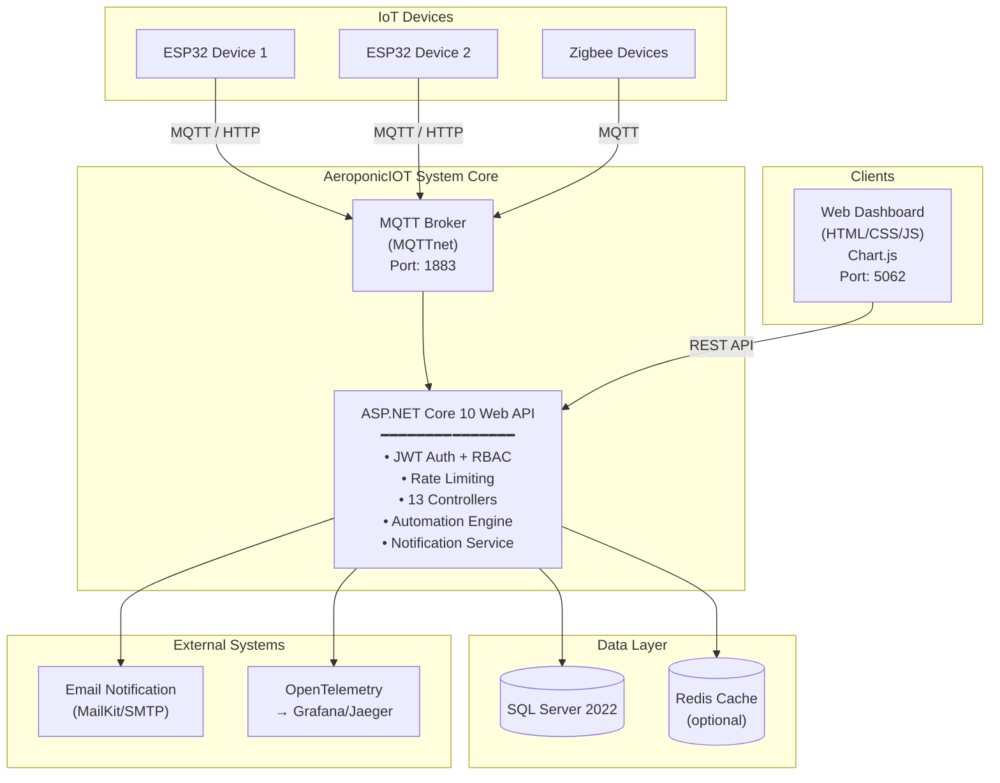
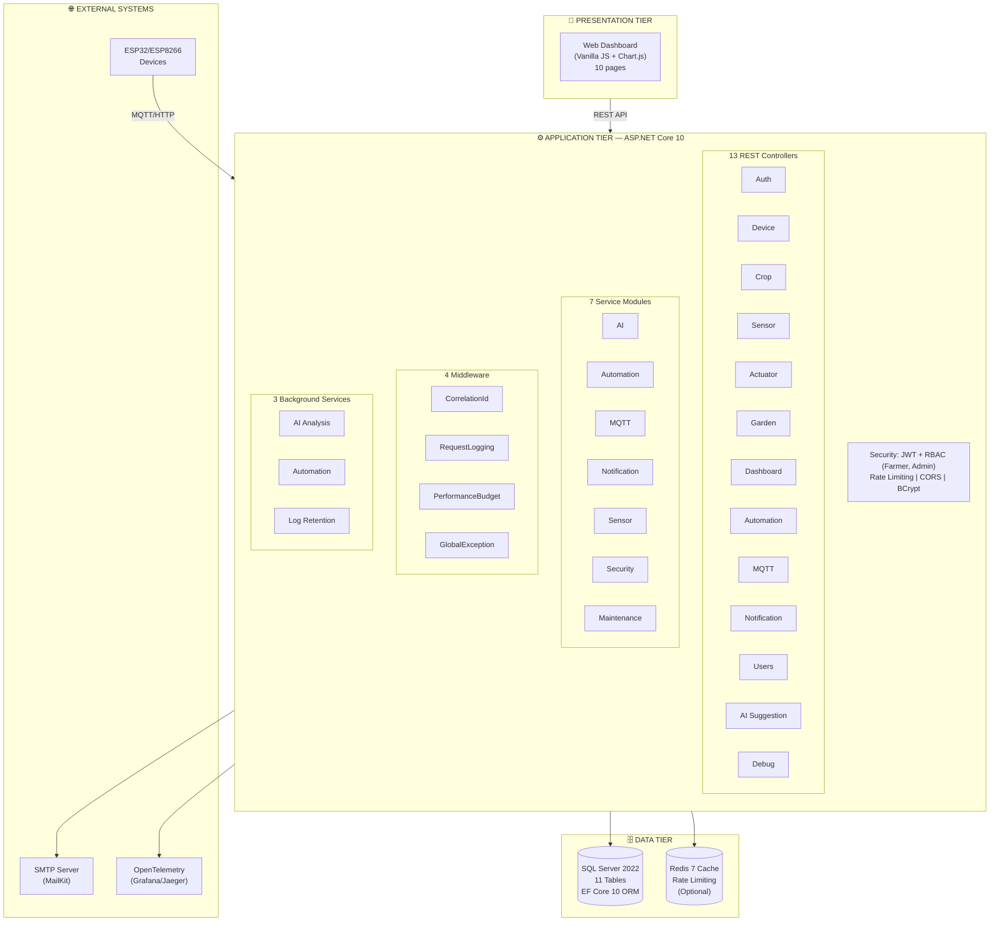
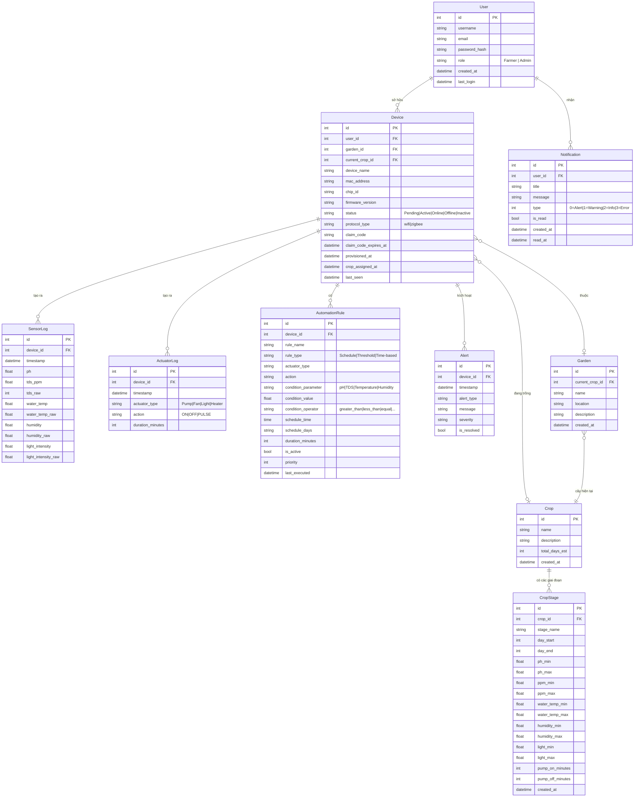
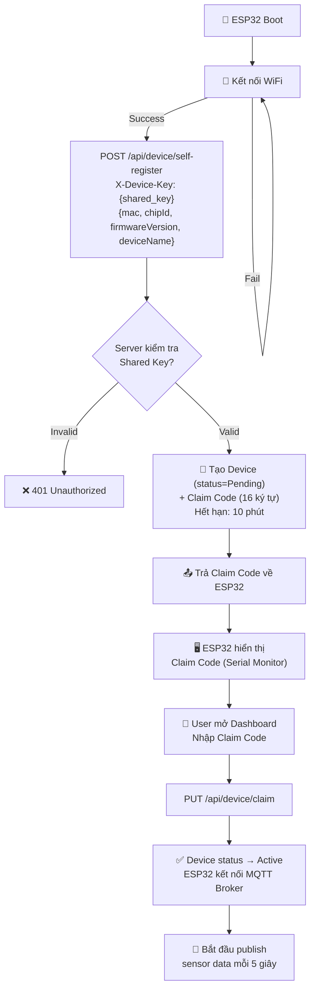
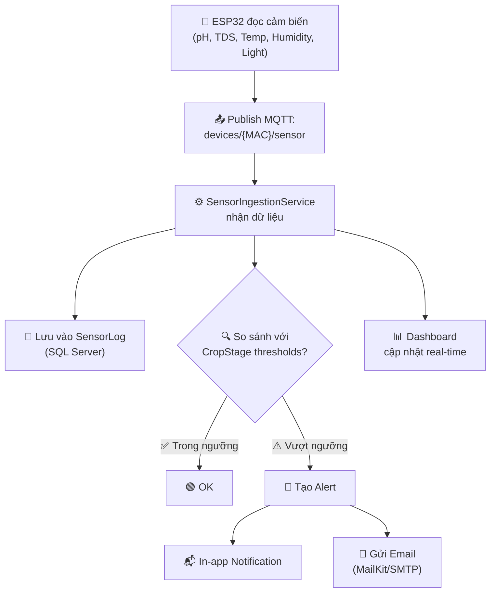
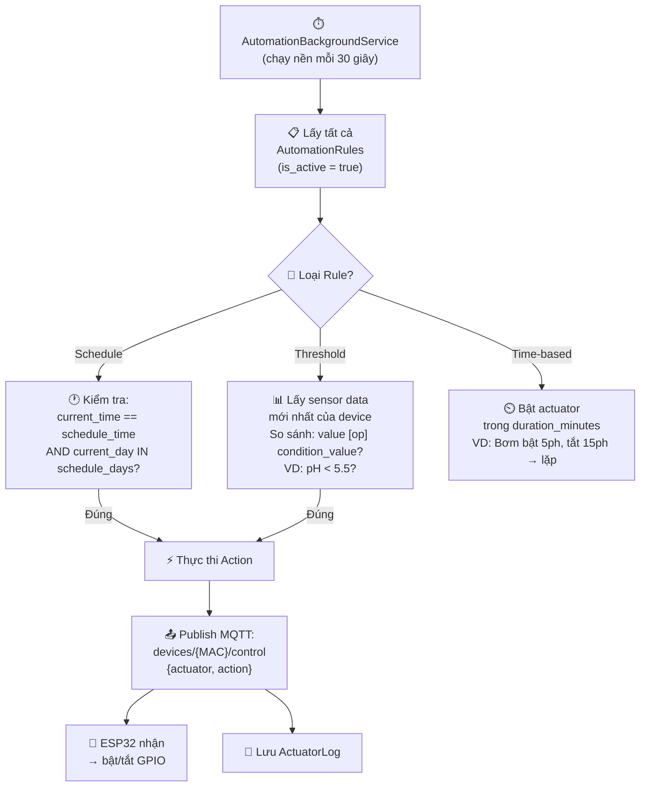
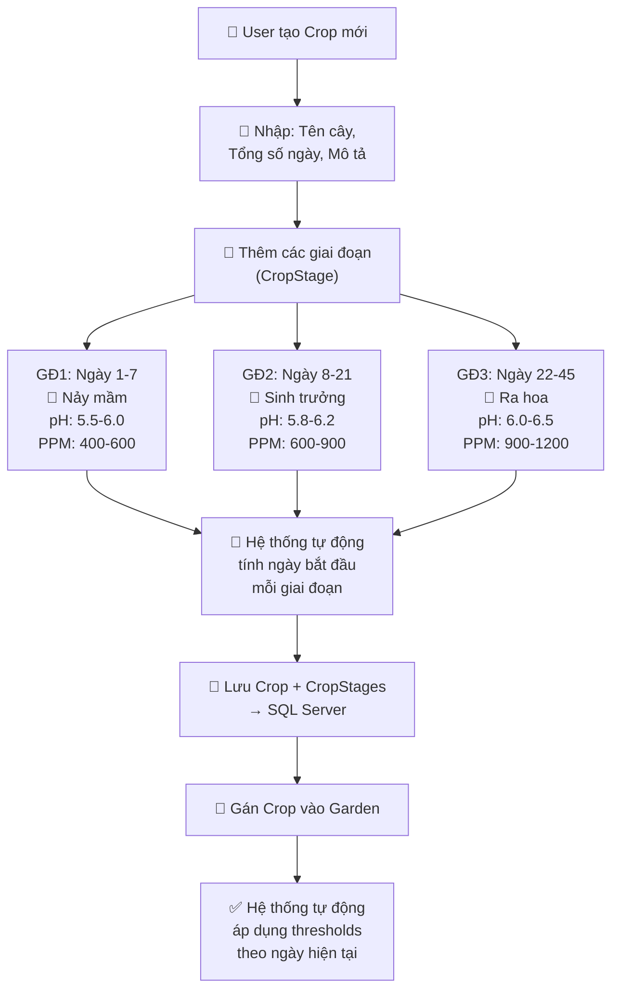
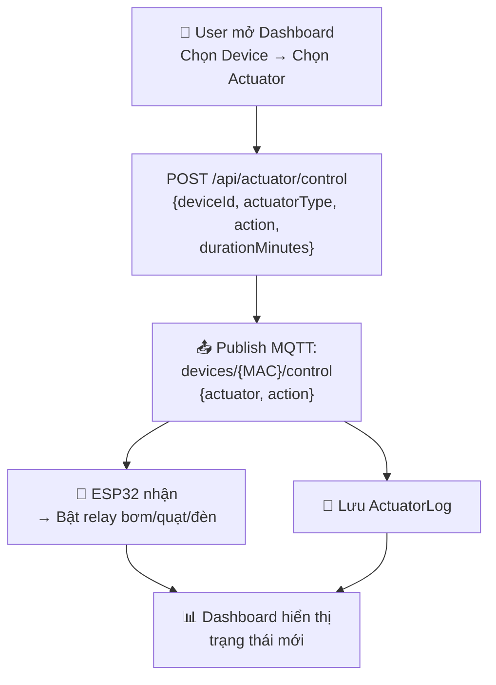

# AEROPONICIOT — SMART FARM IoT MONITORING & CONTROL SYSTEM

## BÀI THUYẾT TRÌNH DỰ ÁN

---

## SLIDE 1 — TRANG BÌA

> **AEROPONICIOT**
> Hệ Thống Giám Sát & Điều Khiển Nông Nghiệp Khí Canh Thông Minh

- Tên dự án: AeroponicIOT — Smart Farm IoT Monitoring and Control System
- Nhóm thực hiện: (điền tên thành viên)
- Mentor/GVHD: (điền tên)

---

## SLIDE 2 — THÀNH VIÊN NHÓM

| STT | MSSV | Họ và Tên | Vai trò |
|-----|------|-----------|---------|
| 1 | | | |
| 2 | | | |
| 3 | | | |
| 4 | | | |
| 5 | | | |

> 📝 **Ghi chú:** Điền danh sách thành viên và phân công vai trò (Backend, Frontend, Firmware, DevOps, Testing...)

---

## SLIDE 3 — NỘI DUNG (TABLE OF CONTENTS)

```
01 — TỔNG QUAN BỐI CẢNH (CONTEXT OVERVIEW)
02 — VẤN ĐỀ & GIẢI PHÁP (PROBLEMS & SOLUTIONS)
03 — YÊU CẦU CHỨC NĂNG (FUNCTIONAL REQUIREMENTS)
04 — KIẾN TRÚC HỆ THỐNG (SYSTEM ARCHITECTURE)
05 — LUỒNG CHÍNH (MAIN FLOWS)
06 — CÔNG NGHỆ SỬ DỤNG (TECH STACK)
07 — HẠN CHẾ & HƯỚNG PHÁT TRIỂN (LIMITATIONS)
08 — Q&A
```

---

## SLIDE 4-5 — TỔNG QUAN BỐI CẢNH (CONTEXT OVERVIEW)

### 🌱 Bối cảnh

Nông nghiệp khí canh (aeroponics) là phương pháp trồng cây không cần đất, rễ cây lơ lửng trong không khí và được phun sương dinh dưỡng định kỳ. Đây là công nghệ tiên tiến giúp:

- Tiết kiệm **90-95% nước** so với nông nghiệp truyền thống
- Tăng trưởng nhanh hơn **30-50%**
- Không cần thuốc trừ sâu
- Kiểm soát hoàn toàn môi trường dinh dưỡng

### ⚠️ Thách thức

| # | Vấn đề |
|---|--------|
| 1 | Người trồng phải theo dõi thủ công các chỉ số pH, TDS, nhiệt độ, độ ẩm, ánh sáng |
| 2 | Mỗi loại cây trồng có ngưỡng thông số khác nhau theo từng giai đoạn sinh trưởng |
| 3 | Phản ứng chậm khi môi trường vượt ngưỡng → cây bị sốc, giảm năng suất |
| 4 | Khó quản lý nhiều vườn/nhiều thiết bị cùng lúc |
| 5 | Thiếu công cụ phân tích dữ liệu lịch sử để tối ưu quy trình trồng |
| 6 | Thiết bị IoT cần cơ chế tự đăng ký, cấu hình đơn giản, bảo mật |

> 📝 **Mẹo trình bày:** Dùng biểu đồ/hình ảnh minh họa mô hình khí canh và các thông số môi trường cần kiểm soát.

---

## SLIDE 6-8 — VẤN ĐỀ & GIẢI PHÁP (PROBLEMS & SOLUTIONS)

### VẤN ĐỀ

| # | Vấn đề chi tiết |
|---|-----------------|
| 1 | **Giám sát thủ công:** Người nông dân phải đo pH, TDS, nhiệt độ bằng tay → tốn thời gian, dễ sai sót |
| 2 | **Phản ứng chậm:** Khi bơm tắt hoặc pH vượt ngưỡng, không có cảnh báo tự động → cây hư hại |
| 3 | **Quản lý cây trồng phức tạp:** Mỗi cây có nhiều giai đoạn (nảy mầm, sinh trưởng, ra hoa, thu hoạch) với thông số khác nhau |
| 4 | **Tự động hóa hạn chế:** Thiếu cơ chế bật/tắt thiết bị theo lịch hoặc theo điều kiện môi trường |
| 5 | **Phân tích dữ liệu kém:** Không có công cụ xem lịch sử, biểu đồ xu hướng để cải thiện quy trình |
| 6 | **Quản lý thiết bị IoT:** Thiết bị mới cần cấu hình thủ công, không có cơ chế tự đăng ký an toàn |

### GIẢI PHÁP

| # | Giải pháp của AeroponicIOT |
|---|----------------------------|
| 1 | **Giám sát real-time:** Cảm biến pH, TDS, nhiệt độ, độ ẩm, ánh sáng gửi dữ liệu liên tục qua MQTT → Dashboard cập nhật tức thì |
| 2 | **Cảnh báo tự động:** Hệ thống phát hiện vượt ngưỡng → gửi Email + In-app Notification ngay lập tức |
| 3 | **Quản lý cây trồng đa giai đoạn:** Cấu hình thông số riêng cho từng giai đoạn (nảy mầm, sinh trưởng...) của từng loại cây |
| 4 | **Automation Engine:** 3 loại rule — theo lịch (Schedule), theo ngưỡng (Threshold), theo thời gian (Time-based) → tự động bật/tắt bơm, quạt, đèn, máy sưởi |
| 5 | **Phân tích dữ liệu:** Biểu đồ Chart.js real-time + lịch sử, KPI dashboard |
| 6 | **Tự đăng ký thiết bị (Self-Provisioning):** ESP32 tự gọi API với Shared Key → nhận Claim Code → user xác nhận qua Dashboard → thiết bị hoạt động |

---

## SLIDE 9 — SƠ ĐỒ NGỮ CẢNH (CONTEXT DIAGRAM)



---

## SLIDE 10-12 — KIẾN TRÚC HỆ THỐNG (SYSTEM ARCHITECTURE)

### Kiến trúc 3 tầng (3-Tier Architecture)



### Data Flow (Luồng dữ liệu)

1. **Sensor → Cloud:** ESP32 đọc cảm biến → publish MQTT topic `devices/{MAC}/sensor` → MQTT Broker nhận → SensorIngestionService lưu vào DB → kiểm tra ngưỡng → tạo Alert nếu vượt
2. **Cloud → Actuator:** Automation Engine đánh giá rules → gửi lệnh qua MQTT topic `devices/{MAC}/control` → ESP32 nhận → bật/tắt thiết bị
3. **Dashboard → API:** User thao tác trên Web → gọi REST API (JWT) → Business Logic xử lý → trả JSON

---

## SLIDE 13 — CÔNG NGHỆ SỬ DỤNG (TECH STACK)

### Backend

| Công nghệ | Mục đích |
|-----------|----------|
| **.NET 10 / ASP.NET Core** | Web API Framework |
| **Entity Framework Core 10** | ORM — Code First Migrations |
| **SQL Server 2022** | Cơ sở dữ liệu chính |
| **Redis 7** | Distributed Cache + Rate Limiting |
| **JWT (JSON Web Token)** | Xác thực & Phân quyền |
| **BCrypt** | Mã hóa mật khẩu |
| **Swagger / OpenAPI** | Tài liệu API tự động |

### IoT & Giao tiếp

| Công nghệ | Mục đích |
|-----------|----------|
| **MQTTnet** | MQTT Broker nhúng trong ứng dụng |
| **Zigbee2MQTT Bridge** | Tích hợp thiết bị Zigbee |
| **Arduino Framework (C++)** | Firmware cho ESP32/ESP8266 |
| **ArduinoJson** | Parse/Serialize JSON trên MCU |
| **PubSubClient** | MQTT Client trên ESP32 |

### Frontend

| Công nghệ | Mục đích |
|-----------|----------|
| **HTML5 / CSS3 / JavaScript** | Web Dashboard (Vanilla — không dùng framework) |
| **Chart.js** | Biểu đồ real-time & lịch sử |

### Observability & DevOps

| Công nghệ | Mục đích |
|-----------|----------|
| **OpenTelemetry** | Tracing & Metrics |
| **OTLP Exporter** | Xuất dữ liệu ra Grafana / Jaeger |
| **Docker + Docker Compose** | Container hóa (3 services: app, db, redis) |
| **Health Checks** | `/health/live`, `/health/ready` |

---

## SLIDE 14-15 — MÔ HÌNH DỮ LIỆU (ENTITY RELATIONSHIP DIAGRAM)

### 11 Models / Tables



> 📝 **Giải thích:** User sở hữu nhiều Device. Mỗi Device gửi SensorLog và ActuatorLog. Automation Rule gắn với Device để tự động điều khiển. Crop có nhiều CropStage (giai đoạn sinh trưởng). Garden chứa các Device và có 1 Crop hiện tại.

---

## SLIDE 16-22 — YÊU CẦU CHỨC NĂNG (FUNCTIONAL REQUIREMENTS)

### ACTORS (Tác nhân)

| Actor | Mô tả |
|-------|-------|
| 🧑‍🌾 **Farmer (Nông dân)** | Người dùng chính — quản lý vườn, thiết bị, cây trồng, xem dashboard |
| 👨‍💼 **Administrator (Quản trị viên)** | Quản lý toàn hệ thống — quản lý users, thiết bị pending, cấu hình hệ thống |
| 🤖 **IoT Device (ESP32)** | Thiết bị phần cứng — gửi dữ liệu cảm biến, nhận lệnh điều khiển |

---

### Chức năng cho FARMER

| # | Chức năng | Mô tả |
|---|-----------|-------|
| 1 | **Đăng ký / Đăng nhập** | Tạo tài khoản, đăng nhập bằng JWT |
| 2 | **Dashboard tổng quan** | Xem tất cả thiết bị, chỉ số mới nhất (pH, TDS, nhiệt độ, độ ẩm, ánh sáng) |
| 3 | **Quản lý thiết bị** | Thêm thiết bị mới (nhập Claim Code), xem danh sách, xem chi tiết, xóa |
| 4 | **Quản lý vườn (Garden)** | Tạo vườn, gán thiết bị vào vườn, chọn cây trồng hiện tại cho vườn |
| 5 | **Quản lý cây trồng (Crop)** | Tạo loại cây, cấu hình nhiều giai đoạn sinh trưởng với ngưỡng pH, PPM, nhiệt độ, độ ẩm, ánh sáng riêng |
| 6 | **Điều khiển thiết bị thủ công** | Bật/tắt bơm, quạt, đèn, máy sưởi từ Dashboard |
| 7 | **Tự động hóa (Automation)** | Tạo rule: theo lịch (08:00 mỗi ngày), theo ngưỡng (pH < 5.5 → bật bơm), theo thời gian (bật 5 phút, tắt 15 phút) |
| 8 | **Xem biểu đồ & lịch sử** | Biểu đồ Chart.js — chọn thiết bị, khoảng thời gian, loại dữ liệu |
| 9 | **Nhận thông báo** | In-app notification + Email khi chỉ số vượt ngưỡng |
| 10 | **Xem lịch sử điều khiển** | Log các lần bật/tắt thiết bị |

---

### Chức năng cho ADMIN

| # | Chức năng | Mô tả |
|---|-----------|-------|
| 1 | **Quản lý người dùng** | Xem danh sách, xóa, đổi role (Farmer ↔ Admin) |
| 2 | **Duyệt thiết bị mới** | Xem danh sách thiết bị Pending, phê duyệt/từ chối |
| 3 | **Cấu hình hệ thống** | JWT secret, MQTT config, Email config, CORS origins |
| 4 | **AI Analysis** | Phân tích dữ liệu cảm biến bằng AI, đưa ra gợi ý cải thiện |
| 5 | **Health Monitoring** | Kiểm tra trạng thái hệ thống (DB, MQTT, Memory) |

---

### Chức năng cho IoT DEVICE (ESP32)

| # | Chức năng | Mô tả |
|---|-----------|-------|
| 1 | **Tự đăng ký (Self-Provisioning)** | Gọi API `POST /api/device/self-register` với Shared Key → nhận Claim Code |
| 2 | **Gửi dữ liệu cảm biến** | Publish MQTT mỗi 5 giây: pH, TDS, nhiệt độ nước, độ ẩm, ánh sáng |
| 3 | **Nhận lệnh điều khiển** | Subscribe MQTT topic `devices/{MAC}/control` → bật/tắt actuator |
| 4 | **Hỗ trợ WiFi + Zigbee** | Giao tiếp qua WiFi (HTTP/MQTT) hoặc Zigbee2MQTT Bridge |

---

## SLIDE 23-29 — LUỒNG CHÍNH (MAIN FLOWS)

### 1. LUỒNG TỰ ĐĂNG KÝ THIẾT BỊ (DEVICE SELF-PROVISIONING)



### 2. LUỒNG GIÁM SÁT & CẢNH BÁO (MONITORING & ALERT)



### 3. LUỒNG TỰ ĐỘNG HÓA (AUTOMATION)



### 4. LUỒNG QUẢN LÝ CÂY TRỒNG (CROP MANAGEMENT)



### 5. LUỒNG ĐIỀU KHIỂN THIẾT BỊ THỦ CÔNG



---

## SLIDE 30-31 — HẠN CHẾ & HƯỚNG PHÁT TRIỂN (LIMITATIONS)

### Hạn chế hiện tại

| # | Hạn chế | Mô tả |
|---|---------|-------|
| 1 | **Giao diện chưa Responsive tối ưu** | Dashboard bằng Vanilla JS, chưa dùng framework hiện đại |
| 2 | **AI Analysis còn đơn giản** | Gợi ý dựa trên rule-based, chưa có Machine Learning thực sự |
| 3 | **Chưa có Mobile App** | Chỉ có Web Dashboard, chưa có app Android/iOS |
| 4 | **Chưa có thanh toán** | Chưa tích hợp thanh toán cho mô hình thương mại (nếu cần) |
| 5 | **Chưa có Video/Livestream** | Chưa hỗ trợ camera giám sát vườn |
| 6 | **Log Retention cơ bản** | Tự động xóa log cũ nhưng chưa có chính sách lưu trữ nâng cao |

### Hướng phát triển

| # | Hướng phát triển |
|---|------------------|
| 1 | **Nâng cấp Frontend:** Chuyển sang React/Vue + TypeScript, Responsive Design |
| 2 | **Mobile App:** React Native hoặc Flutter cho iOS/Android |
| 3 | **AI/ML thực sự:** Dự đoán năng suất, phát hiện bệnh cây qua hình ảnh, tối ưu chu kỳ bơm |
| 4 | **Multi-tenant:** Hỗ trợ nhiều nông trại độc lập trên cùng hệ thống |
| 5 | **Camera Integration:** Livestream + AI nhận diện cây trồng |
| 6 | **Blockchain:** Truy xuất nguồn gốc nông sản |
| 7 | **Voice Control:** Tích hợp trợ lý giọng nói |

---

## SLIDE 32 — Q&A

> **CẢM ƠN THẦY/CÔ VÀ CÁC BẠN ĐÃ LẮNG NGHE!**
>
> *"Smart Farming Today, Sustainable Tomorrow"*

---

## 📋 PHỤ LỤC: GỢI Ý CHUẨN BỊ

### Demo nên chuẩn bị:

1. **Dashboard tổng quan** — Hiển thị các thiết bị đang online, chỉ số real-time
2. **Tạo Crop mới** — Demo thêm cây + các giai đoạn sinh trưởng
3. **Tạo Automation Rule** — Demo rule bật bơm theo lịch hoặc theo ngưỡng pH
4. **Xem biểu đồ lịch sử** — Demo Chart.js với dữ liệu thực
5. **ESP32 tự đăng ký** — Hoặc demo video firmware đang chạy

### Hình ảnh nên có:

- Ảnh mô hình khí canh thực tế
- Ảnh ESP32 + cảm biến
- Sơ đồ kiến trúc (vẽ bằng draw.io hoặc Mermaid)
- Ảnh chụp màn hình Dashboard (các trang chính)

### Video nên chuẩn bị:

- Demo đầy đủ tính năng (3-5 phút)
- Video ESP32 đang gửi dữ liệu + nhận lệnh điều khiển (nếu có phần cứng)

---

> 📄 File này được tạo tự động dựa trên mã nguồn dự án AeroponicIOT và template `MuseTrip360.pdf`.
